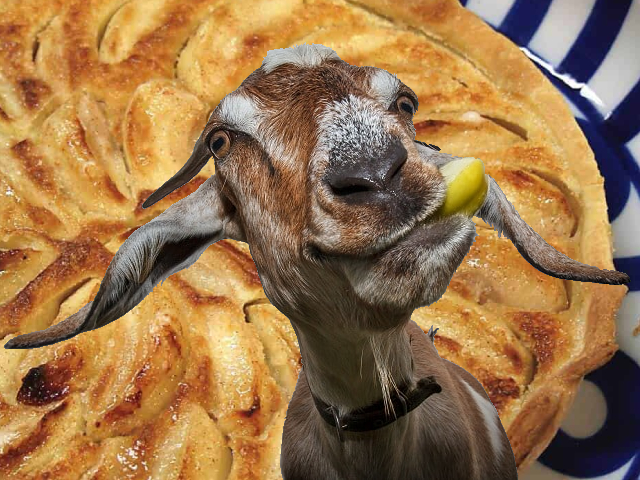

# Recipes

## Apple Tart

prep time 60 minutes 

### Ingredients

wet ingredients 
- 4 thinly sliced cored apples
- 2 eggs
- 1 tbsp milk 
- 1 tsp cinnamon

dry ingredients 
- 2 cups flour
- 2 tbsp butter
- 1 tsp salt
- 1 tsp baking powder

### Directions

Combine apples with other liquid ingredients in a bowl and mix well. Combine flour and other dry ingredients after sifting, and roll into a ball. Refrigerate the dough ball for 30 minutes. Place the ball in between two sheets of parchment paper and roll flat to 1/2 inch thickness. Press the flattened dough into a pie plate. Pour liquid filling into dough and bake for 35 minutes at 375 degrees.

## Delicious Spinach Dish

Prep time: 20 minutes

### ingredients

- 1 pound of ground sausage
- 1 bulb of garlic, diced
- 1 medium yellow onion, diced
- 1 brick or bag of frozen chopped spinach
- 1 can of cream of mushroom soup
- 2 cups of rice

### Directions

Start cooking the rice in a separate pan or rice cooker or whatever. If you're a rockstar, you'll add half a stick of butter to it because fuck yeah.

Brown the sausage in a large pan on medium heat. When brown, add the onion and the garlic. When the onions are translucent, add the frozen spinach, and the can of cream of mushroom soup. Reduce the heat to medium low, and give the spinach some time to thaw. Stir every few minutes, until everything is well mixed and hot.

Combine apples with other liquid ingredients in a bowl and mix well. Combine flour and other dry ingredients after sifting, and roll into a ball. Place the ball in between two sheets of parchment paper and roll flat to 1/2 inch thickness. Press the flattened dough into a pie plate. Pour liquid filling into dough and bake for 35 minutes at 375 degrees. 

Serve the spinach mess over the rice. Goes really well with a little soy sauce and sriracha.

## Grass for Goats

Prep time: Fuck, I don't know, who has time for time for lawn maintenance anymore? Let the Goats eat it. They can eat it at their own pace.

### Ingredients

- grass

### Directions

Feed the grass to the Goats.

Don't let the goats eat your desserts! 🐐
